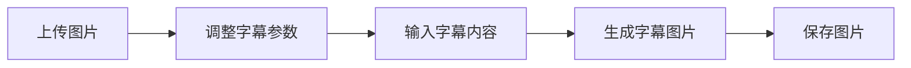

# 产品需求文档：图片字幕生成器

## 1. 产品概述

### 1.1 产品定位
一款轻量级在线图片字幕生成工具，帮助用户快速为图片添加自定义字幕并导出成品图片。

### 1.2 目标用户
- 社交媒体运营人员
- 内容创作者
- 普通用户快速制作带字幕图片

## 2. 功能需求

### 2.1 核心功能

#### 2.1.1 图片上传
- **功能描述**：支持用户上传本地图片文件
- **输入**：本地图片文件（支持JPEG、PNG等常见格式）
- **输出**：显示已上传文件名，图片在预览区加载

#### 2.1.2 字幕设置
| 设置项         | 功能描述                     | 参数范围       | 默认值       |
|----------------|------------------------------|----------------|--------------|
| 字幕高度       | 控制字幕区域垂直高度         | 0~∞ px         | 80px         |
| 字体大小       | 调整字幕文字大小             | 0~∞ px         | 40px         |
| 字体颜色       | 选择字幕文字颜色             | RGB颜色值      | #FFFFFF（白）|
| 轮廓颜色       | 设置文字描边颜色             | RGB颜色值      | #000000（黑）|
| 字体样式       | 选择字体类型                 | 下拉选择列表   | 微软雅黑     |
| 字体粗细       | 调整文字粗细程度             | 下拉选择列表   | 正常         |

#### 2.1.3 字幕内容编辑
- **功能描述**：支持用户输入多行字幕内容
- **输入**：多行文本
- **输出**：实时在预览区显示字幕排版效果

#### 2.1.4 图片生成
- **功能描述**：将字幕与原图合成新图片
- **触发方式**：点击「生成字幕图片」按钮
- **输出**：生成带字幕的图片文件

#### 2.1.5 图片保存
- **功能描述**：下载生成的带字幕图片
- **触发方式**：点击「保存图片」按钮

### 2.2 交互需求

#### 2.2.1 布局设计
```
┌─────────────────┬─────────────────┐
│   左侧控制面板  │   右侧预览区    │
│                 │                 │
│  1. 图片上传    │  实时预览合成   │
│  2. 字幕设置    │  效果           │
│  3. 字幕编辑    │                 │
│  4. 操作按钮    │                 │
└─────────────────┴─────────────────┘
```

#### 2.2.2 操作流程


#### 2.2.3 状态提示
- 成功提示：绿色背景「字幕图片生成成功！」
- 错误提示：红色背景显示具体错误信息

## 3. 非功能需求

### 3.1 性能需求
- 图片上传响应时间 < 2s
- 图片生成时间 < 5s（1MB以下图片）

### 3.2 兼容性需求
- 支持主流浏览器：Chrome、Firefox、Safari、Edge
- 支持响应式布局，适配桌面端和平板设备

### 3.3 安全需求
- 用户上传图片仅在浏览器端处理，不存储到服务器
- 生成图片仅在客户端临时缓存，关闭页面自动清除

## 4. 界面设计

### 4.1 色彩方案
- 主色调：蓝色系（按钮、强调元素）
- 辅助色：绿色（成功提示）、红色（错误提示）
- 中性色：白色（背景）、灰色（边框、文字）

### 4.2 组件规范
- 按钮：圆角矩形设计，悬停效果
- 输入框：带边框设计，聚焦状态高亮
- 颜色选择器：点击弹出调色板
- 下拉菜单：标准下拉选择样式

## 5. 技术实现建议

### 5.1 前端技术栈
- HTML5 + CSS3 + JavaScript
- Canvas API 实现图片合成
- FileReader API 处理图片上传

### 5.2 核心算法
```javascript
// 伪代码示例
function generateImage(originalImage, subtitleConfig, subtitleText) {
    // 1. 创建Canvas元素
    // 2. 绘制原始图片
    // 3. 绘制字幕背景
    // 4. 逐行绘制字幕文字
    // 5. 导出合成图片
}
```

## 6. 验收标准

### 6.1 功能验收
- [ ] 图片上传功能正常
- [ ] 字幕参数调整实时生效
- [ ] 多行字幕正确排版
- [ ] 图片生成成功并可下载
- [ ] 状态提示正确显示

### 6.2 性能验收
- [ ] 1MB图片上传时间 < 2s
- [ ] 图片生成时间 < 5s
- [ ] 界面响应流畅无卡顿

### 6.3 兼容性验收
- [ ] 主流浏览器功能正常
- [ ] 不同分辨率屏幕适配良好

## 7. 版本规划

### V1.0 基础版
- 实现核心功能
- 支持基础字幕样式调整
- 单图片生成与下载

### V1.1 优化版
- 支持批量图片处理
- 添加字幕模板功能
- 支持自定义字幕位置

### V2.0 高级版
- 添加AI字幕自动生成
- 支持多语言字幕
- 提供更多字体样式选择